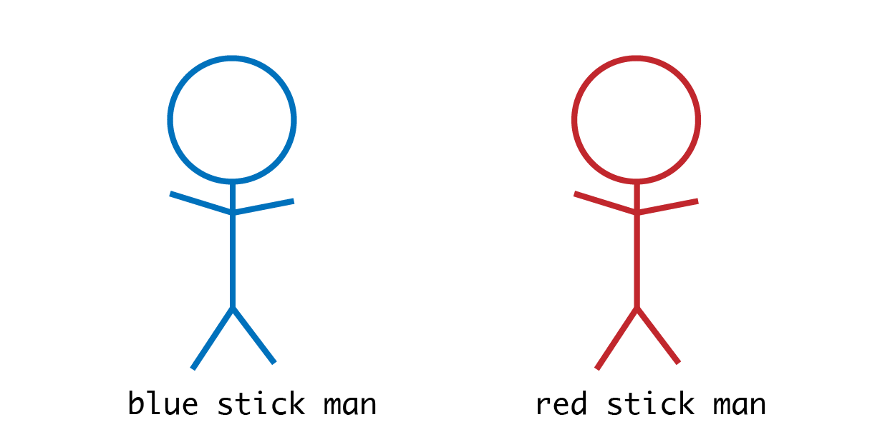

- title : Quick Intro: CSS
- description : A quick introduction into CSS
- author : Johannes Baeurle, Jan Reinhardt
- theme : league
- transition : default

***

## Quick Intro: CSS


### **Katherina Ringwald & Johannes Baeurle**, AIT GmbH <br /> [@JoBaeurle](http://twitter.com/JoBaeurle) | [github JohBa](https://github.com/JohBa) | [aitgmbh.de](http://www.aitgmbh.de/)

***

### Roadmap

 - **Naming Conventions**
 - Structure
 - Debugging

---

### Naming Conventions

#### Why?

* Maintainable Code
* Easier to read
* Relationships between blocks
* Connection to JavaScript hooks?

' Naming is hard, so why do it?

---

### Naming Conventions/Concepts

* **BEM**
* OOCSS
* ACSS
* SMACSS

' Object oriented CSS
' Atomic CSS (Atomic Design)
' Scalable and Modular Architecture for CSS

---

### BEM

<h4 style="color:#76b24f">Block</h4>
Standalone entity that is meaningful on its own.
(`header`, `container`, `menu`, `checkbox`, `input`)

<h4 style="color:#4f91b2">Element</h4>
A part of a block that has no standalone meaning and is semantically tied to its block.
(`menu item`, `list item`, `checkbox caption`, `header title`)

<h4 style="color:#d5635d">Modifier</h4>
A flag on a block or element. Use them to change appearance or behavior.
(`disabed`, `highlighted`, `checked`, `fixed`, `size big`, ...)

---

### BEM


---

### BEM

Block__Element--Modifier

```css
/* This is the Block */
.block {}

/* This is an element, that helps to form the block as a whole */
.block__element {}

/* This modifies the element or a block*/
.block--modifier {}
```

---

### BEM

#### Don't

Don't mimic the DOM-Tree!

```html
<header class="block">
    <h1 class="block__elem1">
        <a class="block__elem1__elem2" href="/">clubmate.fi</a>
    </h1>
</header>
```

---

### BEM

#### Do

Create the BEM-Tree!

```html
<div class='block'>
    <div class='block__elem1'>
        <div class='block__elem2'></div>
    </div>
</div>

<div class='block1'>
    <div class='block2'>
        <div class='block2__elem'></div>
    </div>
</div>
```

---

### BEM Real World

```html
<!-- Block -->
<header class="col-header">
    <!-- Block element -->
    <h1 class="col-header__heading">
        <a class="col-header__link" href="/">clubmate.fi</a>
    </h1>
    <!-- Block element -->
    <span class="col-header__beta">(beta)</span>
    <!-- New Block -->
    <nav class="nav">
        <!-- Block element -->
        <a class="nav__item" href="/">Home</a>
        <!-- Block element -->
        <a class="nav__item" href="/archives">Archives</a>
        <!-- Element and a modifier -->
        <a class="nav__item nav__item--uplink" href="#header">&uarr;</a>
    </nav>
</header>
```

---

### BEM Sample: Block


```css
.stick-man {
  
 }
```

---

### BEM Sample: Elements


```css
.stick-man__head {
}
.stick-man__arms {
}
.stick-man__feet {
}
```

---

### BEM Sample: Modifiers




```css
.stick-man--blue {
}
.stick-man--red {
}
```

---

### BEM Sample: Modifiers


```css
.stick-man__head--small {
}
.stick-man__head--big {
}
```

---

### JavaScript Hooks?

* CSS Classes/Ids as hooks for JavaScript code

```html
<div class="site-navigation js-site-navigation">
</div>
```

```js
const nav = document.querySelector('.js-site-navigation')
```

' Hooks als Mittel für javascript selectors
' wenn möglich ohne styling, falls nötig vorschlag: suffix js

---

***

### Roadmap

 - Naming Conventions
 - **Structure**
 - Debugging

---

### ITCSS

Inverted Triangle CSS


---

### ITCSS

#### Settings
used with preprocessors and contain font, colors definitions, etc.

#### Tools
globally used mixins and functions. It’s important not to output any CSS in the first 2 layers.

#### Generic
reset and/or normalize styles, box-sizing definition, etc. This is the first layer which generates actual CSS.

---

### ITCSS

#### Elements
styling for bare HTML elements (like H1, A, etc.). These come with default styling from the browser so we can redefine them here.

#### Objects
class-based selectors which define undecorated design patterns, for example media object (img etc.)

---

### ITCSS

#### Components
specific UI components. This is where majority of our work takes place and our UI components are often composed of Objects and Components

#### Utilities
utilities and helper classes with ability to override anything which goes before in the triangle, eg. hide helper class

---

### How?

* Folder structure
* Selector Prefixes (`o-`, `c-`, `u-`, `has-`, `is-`, ...)
* Filenames (`object.media.scss`, `component.header.scss`, ...)

' Vorteile bei Selector Prefixes, "Healtchecks" über eigene CSS Regeln möglich
' In ecoPage bislang über Folder Structure

---


***

### Roadmap

 - Naming Conventions
 - Structure
 - **Debugging**

---

### Debugging CSS

Debugging is hard...


' CSS is permissive, gibt nach
' Wenn was nicht passt wirds einfach ignoriert

---

### Debugging CSS

#### Debugging strategies

* Browser Developer Tools
* IDE Syntax Verification (InBuilt, Extensions, ...)
* [StyleLint](https://github.com/webpack-contrib/stylelint-webpack-plugin)/[CSSLint](https://github.com/CSSLint/csslint)
* Globale CSS Selectoren

' firefox nightly developer tools zeigen
' grid zeigen
' demo

---

***

### Thank you!

* Too many sources, see Sources.txt
